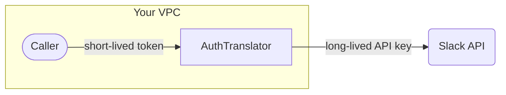

[](https://goreportcard.com/report/github.com/winhowes/AuthTranslator) [](https://codecov.io/gh/winhowes/AuthTranslator) [](https://pkg.go.dev/github.com/winhowes/AuthTranslator)


# AuthTranslator


> **AuthTranslator** is a lightweight, pluggable **reverse‑proxy** that swaps **short‑lived caller credentials** for the **long‑lived tokens** third‑party APIs expect – and it can do the opposite on the way back in.
> *“Stop sprinkling API keys around; translate auth at the edge instead.”*

---

## ✨ Key ideas

| Feature | Details |
|---------|---------|
| Centralized secret custody | Only the proxy stores integration secrets; developers never see them. |
| Plug-in everything | Auth types, secret back-ends, metrics, and integration templates are Go plug-ins. |
| Per-caller / per-integration rate-limits | Backed by Redis or in-memory. |
| Granular request authorization | Grant callers high-level **capabilities** (e.g. `post_as`) or fine-grained filters on path, query, headers, and body. |
| Hot-reload | `SIGHUP` or `-watch` picks up new configs without dropping connections. |

---

## 🚀 30‑second quick‑start

1. Run the proxy (Docker)
```bash
docker run --rm -p 8080:8080 \
  -e SLACK_TOKEN=demo-token \
  -v $(pwd)/examples:/conf \
  ghcr.io/winhowes/authtranslator:latest \
    -config /conf/config.yaml -allowlist /conf/allowlist.yaml -denylist /conf/denylist.yaml
```
Or run from source:
```bash
go run ./app -config examples/config.yaml -allowlist examples/allowlist.yaml -denylist examples/denylist.yaml
```
2. Curl through the proxy
```bash
curl -H "Host: slack" \
     -H "X-Auth: demo-token" \
     -H "Content-Type: application/json" \
     --data '{"channel": "#general", "username": "AuthTranslator", "text": "Hello from AuthTranslator"}' \
     http://localhost:8080/api/chat.postMessage
# alternatively set `X-AT-Int: slack` if you can’t change the Host header
```

---

## 🗺️ How it fits together


```mermaid
graph LR
  subgraph Your VPC
    Caller([Caller])
    AuthT[AuthTranslator]
  end
  Caller -->|short‑lived token| AuthT
  AuthT -->|long‑lived API key| Slack(Slack API)
```

1. **Auth plug‑in** validates + strips caller credential → forwards request allowing your services to use short lived credentials when sending requests to or receiving requests from 3rd parties.
2. The allowlist enforces either capability‑based rules or precise filters on path, method, query params, headers, and JSON‑body or form‑data keys.

---

## 📄 Configuration overview

AuthTranslator eats **YAML** (or pure JSON) for two files:

| File             | Purpose                                                                                               |
| ---------------- | ----------------------------------------------------------------------------------------------------- |
| `config.yaml`    | Declares **integrations** – upstream URL, outgoing auth plug‑in, transport tweaks, rate‑limit window. |
| `allowlist.yaml` | Grants each **caller ID** specific HTTP paths/methods **or** named **capabilities**.                  |
| `denylist.yaml`  | Blocks requests per caller when **any** deny rule’s constraint subset matches a path/method.          |

Example snippets live under [`examples/`](examples/) and a full JSON‑Schema is in [`schemas/`](schemas/) – CI fails if you drift.

### Secret back‑ends

Secrets can be pulled from several providers:

* **env:** `SLACK_TOKEN=…`
* **file:** path to an on‑disk file
* **k8s:** Kubernetes secrets
* **gcp:** Google Cloud KMS
* **aws:** AWS Secrets Manager
* **azure:** Azure Key Vault
* **vault:** HashiCorp Vault

Need another store? Writing a plug‑in takes \~50 LoC – see [`app/secrets/plugins/env`](app/secrets/plugins/env).

---

## 🔧 CLI helpers

```bash
# List loaded integrations
go run ./cmd/integrations list

# Add a Slack integration from env vars
go run ./cmd/integrations slack \
  -token env:SLACK_TOKEN -signing-secret env:SLACK_SIGNING
```

Also see [`cmd/allowlist`](cmd/allowlist) for CRUD operations on the allowlist.

---

## 📊 Observability & ops

| Endpoint                | Purpose                                                                |
| ----------------------- | ---------------------------------------------------------------------- |
| `/_at_internal/healthz` | Liveness probe – returns **200 OK** when the proxy is running.         |
| `/_at_internal/metrics` | Prometheus metrics (request totals, status codes, latency, rate‑limit and auth failures plus Go runtime metrics). |
| Structured logs         | Text by default; pass `-log-format json` for JSON via `slog`. Includes method, integration, path, status; adds `caller_id` when known. |

Official container images include a Docker HEALTHCHECK that polls the health endpoint; the container reports **healthy** once it returns 200.
---

## 📚 Documentation map

* **Docs home** – [`/docs`](docs/) – deep dives, secret back‑ends, Terraform, plug‑in guides.
* **Examples** – [`/examples`](examples/) – minimal runnable configs.
* **Helm chart** – [`charts/authtranslator`](charts/authtranslator) – `helm install authtranslator charts/authtranslator` in one line.

---

## 🛠️ Development

```bash
make precommit  # fmt + vet + lint
make test       # run unit tests
make tidy       # update go.mod/go.sum
make ci         # run full checks + tests with coverage
make docker     # build container
```

* Requires **Go 1.26.2+**.
* Run `golangci‑lint run` to match CI.

---

## 🤝 Contributing & security

Found a bug? Have an auth plug-in idea? Open an issue or PR – but please read [`CONTRIBUTING.md`](CONTRIBUTING.md) first.
Security issues? Email **[security@authtranslator.dev](mailto:security@authtranslator.dev)** – see [`SECURITY.md`](SECURITY.md).

---

## 📝 License

MIT © Winston Howes & contributors.
